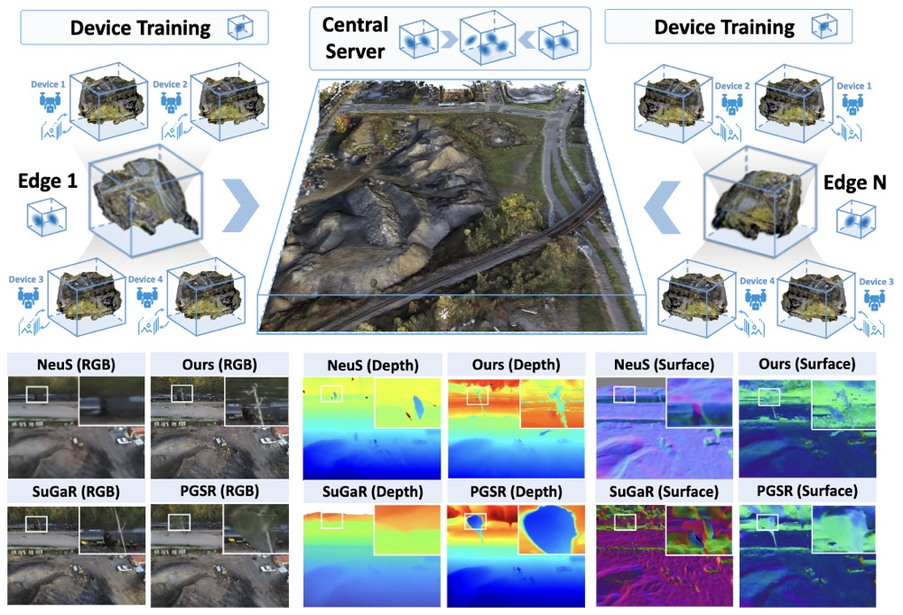
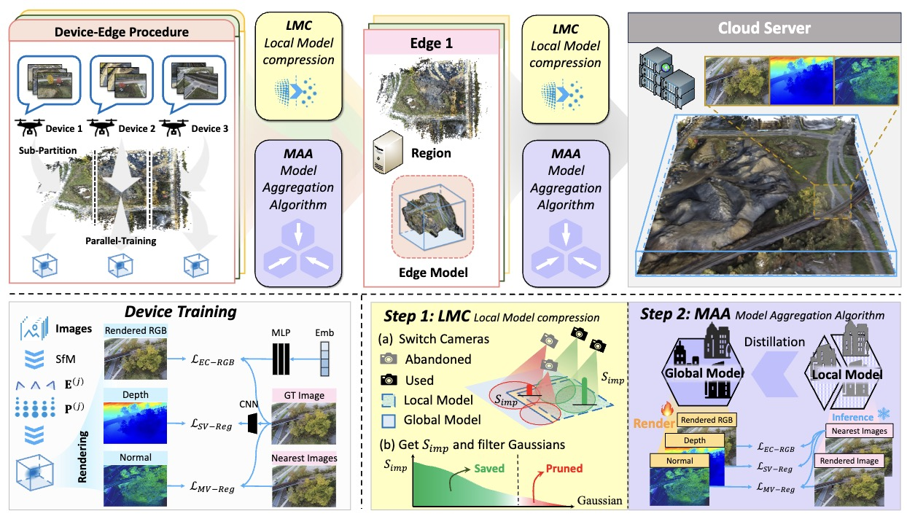

# CoSurfGS
CoSurfGS: Collaborative 3D Surface Gaussian Splatting with Distributed Learning for Large Scene Reconstruction

### [Project Page](https://gyy456.github.io/CoSurfGS/) | [Paper](https://arxiv.org/abs/2412.17612)
<!-- Code is coming soon. -->

<br/>

> 

> Yuanyuan Gao, Yalun Dai, Hao Li, [Weicai Ye](https://ywcmaike.github.io/), Junyi Chen, Danpeng Chen, Dingwen Zhang, Tong He, Guofeng Zhang, Junwei Han
> 
## Teaser

First cloud-edge-device hierarchical framework with federated learning for large-scale high-fidelity surface reconstruction in a distributed manner, achieving balance between high-precision reconstruction and low-cost memory.


## Framework



## Brewing🍺, code coming soon.
## Citation

If you find this code useful for your research, please use the following BibTeX entry.

```bibtex
@article{Gao2024CoSurfGS,
          title={CoSurfGS: Collaborative 3D Surface Gaussian Splatting with Distributed Learning for Large Scene Reconstruction},
          author={Yuanyuan Gao and Yalun Dai and Hao Li and Weicai Ye and Junyi Chen and Danpeng Chen and Dingwen Zhang and Tong He and Guofeng Zhang and Junwei Han},
          booktitle={arxiv preprint},
          year={2024},
      }
      
```
